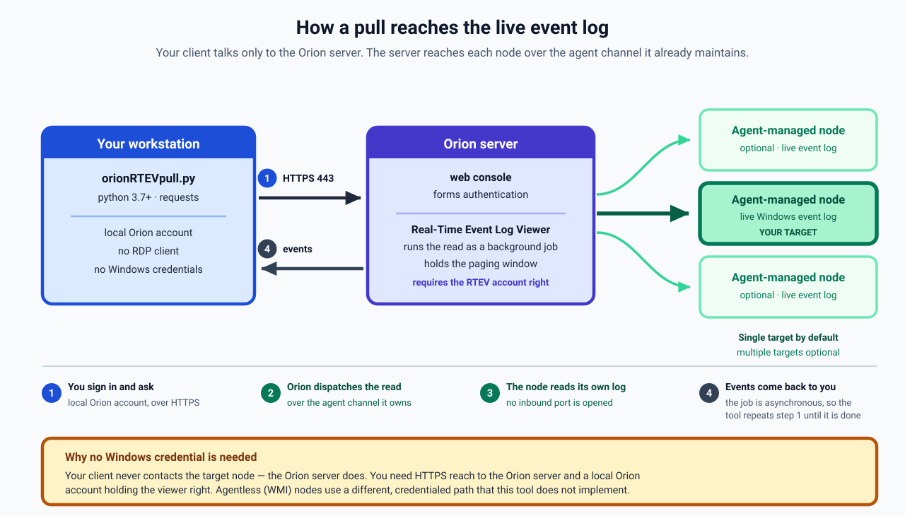

# orionRTEVpull

**Version 1.0.**

Programmatic access to the **live Windows event log** on a SolarWinds Orion
**agent-managed** node — without RDP, Windows credentials, or a browser. Built
for ad-hoc incident forensics: pulling log evidence from a host you cannot RDP
into, without waiting for central log collection to have been turned on ahead
of the incident.

It authenticates to the Orion web console with a local Orion account and
automates the SAM **Real-Time Event Log Viewer**, handling the parts that make
that awkward from a script: the asynchronous request/poll cycle, deep paging
with de-duplication, session expiry, the server's response-size ceiling, and
slow or unresponsive nodes. One file, one dependency (`requests`).



## Why not Log Manager?

Orion Log Manager / Log Analyzer only shows what it has **centrally
collected** — useless for a node where collection was enabled after the
incident, or never. This reads the **live** event log on the host instead, so
it reaches back as far as Windows' own retention.

## How it works

- **On agent-managed nodes the Orion server does the endpoint contact — not
  this tool and not your workstation.** That is why no Windows credential is
  needed: the request rides the existing Orion agent channel. Your client only
  ever talks to the Orion server, over HTTPS.
- **Agentless (WMI) nodes use a different, credentialed path this tool does
  not implement.**
- **The request path is asynchronous, so the tool polls.** A first request
  dispatches the work and can come back still-pending; the tool re-issues until
  real events arrive or the job reports done. This is why you should go through
  the provided functions (or the CLI) rather than issuing a single raw
  request — one un-polled request can look like an empty log when the job
  simply has not finished yet.

## Prerequisites

- **Python 3.7+ with `requests`** (`pip install requests`) — the only
  install. `urllib3` comes with it and is imported directly; **urllib3 2.x is
  preferred**, because on 1.26 the body reader falls back to a byte-at-a-time
  path that cannot detect a truncated gzip body. Developed and tested on
  Python 3.11; 3.7+ is supported in the code but unverified here, and on 3.7
  pip resolves end-of-life requests/urllib3 releases — prefer a current
  interpreter.
- **A local Orion account.** Login uses the console's standard forms
  authentication, which only local accounts go through — SSO/IdP accounts never
  touch this path (that is exactly what makes headless login possible).
- **The Real-Time Event Log Viewer account right** granted to that account in
  the web console. See [Permissions](#permissions).
- **An agent-managed target node.** Its NodeID is visible in the Node Details
  page URL as `NetObject=N:1234`.
- **HTTPS (443) reach to the Orion server** — and only the server. The client
  never contacts the target node.

## Usage

    python3 orionRTEVpull.py 1234 "Service Control Manager" \
        --host orion.example.com --user jsmith

**Substitute your own values** — every example uses these placeholders:

| Placeholder | Replace with |
|---|---|
| `orion.example.com` | your Orion web console hostname |
| `jsmith` | your **local** Orion account name |
| `1234` | the NodeID of an agent-managed node (visible in the Node Details page URL as `NetObject=N:1234`) |

More:

    # search the Application log, deeper history (up to 12 pages)
    python3 orionRTEVpull.py 1234 "MyService" --log Application --pages 12 \
        --host orion.example.com --user jsmith

    # several nodes at once (bounded worker threads, one section per node)
    python3 orionRTEVpull.py 1234,1235,2001 "MyService" \
        --host orion.example.com --user jsmith

    # squeeze a busy log: auto-size pages to the response ceiling, and
    # re-sweep on fresh logins until no new events arrive (up to 6 rounds)
    python3 orionRTEVpull.py 1234 "MyService" --auto-limit --deep \
        --host orion.example.com --user jsmith

    # a console with an untrusted certificate, overridden for this run only
    python3 orionRTEVpull.py 1234 "MyService" --insecure \
        --host orion.example.com --user jsmith

`--pages` bounds how many requests the sweep makes (default **6**, sized for
interactive quick checks — raise it for deep sweeps). Paging ends when the
server returns an empty page — its only reliable end-of-data signal — and if
the page limit is reached first, the tool says so on stderr and the result is
a floor rather than an answer. Do not read "no matches" as a negative without
checking for that warning.

**Output contract:** results go to **stdout**; every completeness verdict and
warning — the FLOOR, PARTIAL, renewal and stall notes — goes to **stderr**;
and the exit status reflects whether the pull could run, not whether the
sweep was complete (for a multi-node pull it is nonzero only when every node
failed). When scripting the CLI, capture both streams (`2>&1`), or use the
library and read `.complete` (see
[Using it as a library](#using-it-as-a-library)).

**TLS:** the server certificate is verified, and a verification failure is
**fatal by default** — the login POSTs your account password, and an
unverified peer must not receive it. If your console uses a self-signed
certificate or an internal CA, the durable fix is adding it to the OS trust
store; `--insecure` overrides for a single run and prints a warning.

## What the hardened tool does for you

- **Polls for you.** One request is never enough (see
  [How it works](#how-it-works)); the tool re-issues until a terminal status
  or the first real events arrive, so it never reports a still-pending job as
  an empty log.
- **Pages deep and de-duplicates**, stopping only on the server's genuine
  end-of-data signal.
- **Recovers from the response-size ceiling.** When the server refuses to
  serialize a too-large response, the tool distinguishes that from a
  missing-right error with a minimal probe, then halves the page size on a
  fresh login and continues — large pulls degrade instead of failing.
- **`--auto-limit`** sizes pages to the measured bytes-per-row of the log at
  hand, running bigger pages on lean logs and smaller on fat ones.
- **`--deep`** re-sweeps on fresh logins while new unique events keep
  arriving (up to 6 rounds), reaching materially more history on busy logs.
- **Multi-node pulls** run one worker thread and one session per node
  (`--workers`, default 4), so a slow or broken node never blocks the rest.
- **Survives session expiry** mid-sweep by re-authenticating once. Because
  the renewal restarts the server-side paging window, the result is flagged
  `renewed` and never claims completeness — plus a stderr warning.
- **Fails honestly.** Partial results are labeled PARTIAL, truncated sweeps
  are labeled a FLOOR, and known cryptic server errors are translated into
  plain language.

## Credentials

There is deliberately **no `--password` flag** — passwords on a command line
leak into process lists and shell history. Credentials resolve in this order
(first hit wins): CLI flag → `ORION_*` environment variable → `--env` file →
interactive prompt (password only).

**1. Interactive prompt** — nothing touches disk or history:

    $ python3 orionRTEVpull.py 1234 "pattern" --host orion.example.com --user jsmith
    Orion password for jsmith@orion.example.com:

**2. Environment variables:**

    export ORION_HOST=orion.example.com
    export ORION_USER=jsmith
    export ORION_PASSWORD='...'      # ORION_PASS also accepted; omit to be prompted
    python3 orionRTEVpull.py 1234 "pattern"

(PowerShell: `$env:ORION_HOST = "orion.example.com"`, etc.)

**3. A `KEY=VALUE` env file** — convenient for repeated runs:

    # orion.env — keep it private (chmod 600); *.env is gitignored here
    ORION_HOST=orion.example.com
    ORION_USER=jsmith
    ORION_PASSWORD=...

    python3 orionRTEVpull.py 1234 "pattern" --env ./orion.env

`--env` and the examples' `--targets` are read whole and are capped at 1 MB —
they are small config files, and the cap keeps a path pointed at a stream or a
device from consuming memory without bound.

If no method supplies a password and the session is interactive, you get a
prompt; in a pipeline you get a clean error instead of a hang.

## Using it as a library

The module is importable, and the Stability warning below assumes you keep
all access behind it:

```python
from orionRTEVpull import connect, fetch_events, search, format_hit, OrionError

s, resp, authed = connect("orion.example.com", "jsmith", password)
if not authed:
    raise SystemExit("login failed — is this a LOCAL Orion account?")

# one page of raw event dicts (never a pending-empty result)
page = fetch_events(s, "orion.example.com", 1234, log="System", limit=200)
events = page.get("Events") or []   # the whole payload dict is returned

# or: regex over Message/SourceName, paging back and de-duplicating
res = search(s, "orion.example.com", 1234, r"Service Control",
             log="System", max_pages=30, limit=200)
for h in res.hits:
    print(format_hit(h))
if not res.complete:
    print("incomplete sweep - treat this as a floor, not an answer")
```

`search()` returns a `SearchResult` that unpacks as the historical
`(hits, unique_events_scanned)` two-tuple — existing callers keep working —
and additionally carries the completeness verdicts in-band: `.exhausted`
(the whole log was reached — in `--deep` mode that means the sweep also
converged, not merely that the last round hit an end-of-data page),
`.partial` (a mid-sweep failure ended the run early), `.stalled` (the paging
anchor pinned), `.renewed` (the session expired mid-sweep and was renewed,
restarting the server's paging window — so depth coverage is unreliable and a
later end-of-data page cannot be trusted), and the derived `.complete`. Treat
anything other than `.complete` as a floor. The same verdicts appear per node
in `search_many()` results.

`SearchResult` unpacks like a two-tuple but is not one, which matters in
exactly one place: serializing it. `json.dumps(result)` raises. Use
**`result.as_dict()`**, which returns exactly the shape `search_many()` gives
you per node — `{hits, scanned, exhausted, partial, stalled, renewed,
complete}` — so single-node and multi-node results can be handled by the same
code:

```python
import json
res = search(s, "orion.example.com", 1234, r"Service Control")
json.dumps(res.as_dict(), default=str)     # default=str: `utc` is a datetime
```

**Watch the unpacking form.** `hits, scanned = search(...)` still works, but it
silently discards all four completeness verdicts — the signal that tells you
whether "no matches" is an answer or a floor. Prefer keeping the result object
and reading `.complete`.
Each hit is a dict with these keys, **any of which may be `None`**:

| key | value |
|---|---|
| `utc` | timezone-aware `datetime` (UTC), or `None` if the timestamp did not parse |
| `code` | event code |
| `src` | source name |
| `user` | account, `None` for most Service Control Manager events |
| `msg` | whitespace-collapsed message, truncated to 200 chars |

`format_hit(h)` renders one hit safely regardless of which fields are
missing. Completeness verdicts are carried on the result object (see above)
and are also printed to stderr — unconditionally, per the Output contract in
[Usage](#usage).

**Exceptions.** Everything raised derives from `OrionError`, which derives
from `RuntimeError`; `RtevTimeout` additionally derives from `TimeoutError`.

| class | meaning |
|---|---|
| `OrionError` | base: HTTP failure, node-side error, bad input, unreachable host |
| `SessionExpired` | the login session expired; `fetch_events()` recovers from this automatically once |
| `RtevTimeout` | the job never reached a terminal state in the time allowed |
| `ResponseTooLarge` | the server refused to serialize the response (the size ceiling); `search()` recovers by halving the limit on a fresh login |

Three opt-ins on `search()`, all reachable from the CLI: `auto_limit=True`
(`--auto-limit`), `deep=True` (`--deep`), and
`search_many(host, user, password, node_ids, pattern, ...)` (CLI: a
comma-separated node list) which fans out across nodes on bounded worker
threads — one session per node, one result or error per node.
`connect()` returns a session that can re-authenticate itself; pass
`insecure=True` to allow an unverified certificate. `MAX_LIMIT` is the
largest usable manual `limit`.

Depth defaults differ by entry point: `search()` defaults to `max_pages=30`
(a deep single-node sweep), while `search_many()` matches the CLI's
interactive default of 6 — pass `max_pages=` explicitly when a fan-out needs
forensic depth.

## Examples

Both take a `--targets` JSON file; `examples/targets.example.json` is a
starting point — copy it and put **real** NodeIDs in it first:

    cp examples/targets.example.json targets.json   # then edit in real NodeIDs

- **`examples/multi_node_timing.py`** — pulls the last N System and
  Application events from every target and reports per-pull timings. The best
  first run: it proves the account, the right, and the tool all work.
- **`examples/logon_failure_sweep.py`** — regex sweep for logon failures
  across targets; defaults to the Security log (read the Security-log caveat
  in Gotchas before trusting an empty result).

Both accept `--env FILE` and `--insecure`, exactly like `orionRTEVpull.py`.
`targets.json` is gitignored; the committed example is not.

## Gotchas, each of which cost a run

- **Empty is not the same as "no events."** Because the request path is
  asynchronous (see [How it works](#how-it-works)), a single un-polled fetch
  can return empty while the job is still pending. `fetch_events()` and
  `search()` poll for you and never report a pending job as an empty log — use
  them rather than hand-rolling a request.
- **A cold first touch of a node/log takes ~10–16 s** while the job
  dispatches; warm pulls return in ~1–6 s. Do not mistake the initial latency
  for a hang.
- **"No matches" can be a floor, not an answer.** `--pages` bounds how many
  requests a sweep makes; if that bound is hit before the log ends, the result
  is a floor and the tool says so on stderr. Do not read "no matches" as a
  negative without checking for that warning, and check the completeness
  verdict (see [Using it as a library](#using-it-as-a-library)).
- **Re-running can legitimately find more.** Deeper history becomes reachable
  across repeated sweeps; `--deep` leans on exactly this to reach further back
  on busy logs. Treat a single pass as a floor, not a complete history.
- **Large pulls can hit a server response-size ceiling.** Past a few MB the
  server refuses to serialize the response and returns an error; the tool
  recognizes it, shrinks the page on a fresh login, and continues, so big
  pulls degrade instead of failing. Manual `--limit` is capped at **1700** for
  this reason; `--auto-limit` sizes each page from the measured bytes-per-row
  and can safely go higher.
- **`--limit` asks for a page size; the server returns several times that many
  rows.** For a strict "last N" you still slice client-side.
- **The client speaks gzip only.** Any other `Content-Encoding` on the
  response — typically an intercepting proxy re-encoding traffic — is refused
  with a clean error rather than decoded. Deliberate: gzip is the one encoding
  the tool can inflate under its own wall clock; anything else would hand the
  read to a decoder loop a hostile stream could hold open indefinitely.
- **Duplicate pages are normal mid-sweep and do not mean the end.** Live
  sweeps produce runs of all-duplicate pages before climbing further back; the
  tool de-duplicates and stops only on the server's genuine end-of-data
  signal. Any client that stops on "no new events" will silently truncate.
- **A broken node reports in plain language.** If the node's own WMI/event
  provider is broken or times out, the pull surfaces it as a translated error
  rather than an HTTP failure — so the pull doubles as a per-log node-health
  probe.
- **The Security log commonly fails to read.** Under the inherited node
  credential the agent often sits pending and then times out on Security,
  while System and Application return in seconds. Either way the tool raises
  rather than returning an empty result that mimics an empty log
  (`--poll-timeout`, default 90 s, decides which side gives up first).
- **Event timestamps are normalized for you.** Parsed hits carry a
  timezone-aware `utc` datetime; if you read the raw payload dicts directly,
  the timestamps are in the console's serialized format and need conversion.
- **`User` is null for Service Control Manager events 7034/7036.** Only
  **7035** ("service was successfully sent a control") names the account — and
  its *absence* is positive evidence that nothing issued a stop.

## Permissions

The Real-Time Event Log Viewer is its own account right, separate from
everything else. To grant it: **Settings → Manage Accounts →** select the
account **→ Edit →** set the **Real-Time Event Log Viewer** option to
**Yes → Submit**. Until it is granted, requests for that account fail with a
server error (HTTP 500) rather than a clean permission error; once granted,
pulls return normally. There is no supported API path for the grant — it is a
console setting.

## Testing

Two suites ship in `tests/`; neither needs a network, credentials, or an
Orion:

    python3 tests/smoke_test.py
    python3 tests/page_retrieval_completeness_test.py

Each prints a PASS/FAIL line per check and exits nonzero if any check fails.
(`pytest tests/` also works — a failing check fails the collected test.)

- **`smoke_test.py`** pins the offline contract: the SearchResult shape and
  verdict truth table, the rendering helpers, input validation,
  credential-file parsing, and the login-page scraper.
- **`page_retrieval_completeness_test.py`** runs real sweeps against a
  modelled server that over-fetches and duplicates the way the endpoint
  does — including the recoverable faults (pending jobs, a mid-sweep expiry,
  the response-size ceiling, stalled anchors, the auto-limit resize) — and
  asserts every record arrives exactly once and the completeness verdicts
  tell the truth.
- After an Orion upgrade, add the **live check** against a lab node — the
  drill the [Stability warning](#stability-warning) below relies on:

      python3 tests/smoke_test.py --live 1234 --host orion.example.com --user jsmith

## Stability warning

This automates a web-console feature, not a supported or contractual API. Its
behavior can change on any Orion upgrade with no deprecation notice. Keep all
access behind this one module, and after every upgrade run the shipped smoke
test's live check ([Testing](#testing)) against a lab node, so a change fails
loudly in one place.

For *scheduled, recurring* log checks, a SAM script monitor is the supported
path. This tool's strength is **ad-hoc, interactive forensics** on hosts with
no RDP access.

## Status

Proven end-to-end against live agent-managed nodes: the poll/complete cycle,
deep paging, the response-size ceiling and its recovery, multi-node fan-out,
and the Security-log stall. A warm pull completes in ~1–6 s; a cold first
touch of a node/log runs ~10–16 s while the job dispatches. On a fresh
deployment the only gate is the Real-Time Event Log Viewer account right
(HTTP 500 until granted).

## License

MIT — see [LICENSE](LICENSE).
